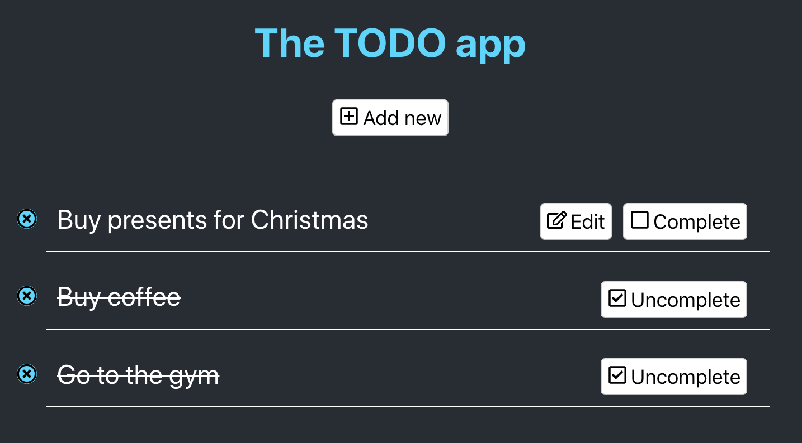

<h1 align="center">
  <br>
  </a>
  <br>
  React TODO list
  <br>
</h1>

<h4 align="center">A simple application for managing a todo list built with <a href="https://reactjs.org" target="_blank">React</a>.</h4>

<p align="center">
  <a href="#key-features">Key Features</a> •
  <a href="#how-to-use">How To Use</a> •
  <a href="#download">Download</a> •
  <a href="#credits">Credits</a> •
  <a href="#related">Related</a> •
  <a href="#license">License</a>
</p>

<p align="center">
  </a>
</p>


## Features

* Create new todo.
* Edit existing one.
* Delete existing one.
* Complete / uncomplete existing one.

## What you can find here
I have built three different approaches using three different ways that React provide us. You can check them in these branches:

 * master
   <p> Here I manage state using component's state and props.</p>

 * with-redux
   <p> This version uses Redux library and manages the state by defining store, reducers and actions.</p>

 * with-hooks-useState
   * Here I have tried with [react hooks](https://reactjs.org/docs/hooks-intro.html), new feature of react which is currently a proposal and it is included in an alpha version of react. From all hooks available I have used __useState__.

### Requirements
 I have used :
 -  node.js v10.12.0
 -  npx 6.4.1

 The project skeleton is built using create-react-app with npx.

## How To Use

```bash
# Clone this repository
$ git clone https://github.com/fjfernandez/todo-list-react

# Go into the repository
$ cd todo-list-react

# Install dependencies
$ npm install

# Run the app
$ npm start
```
